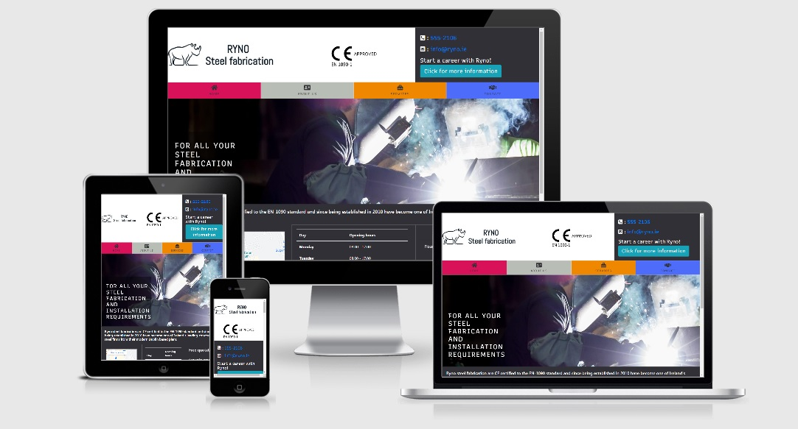
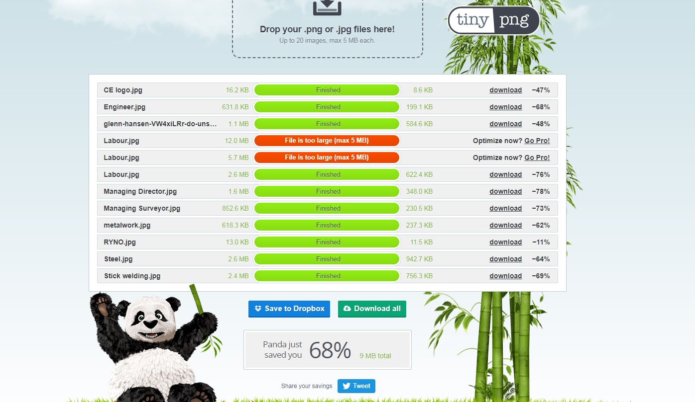
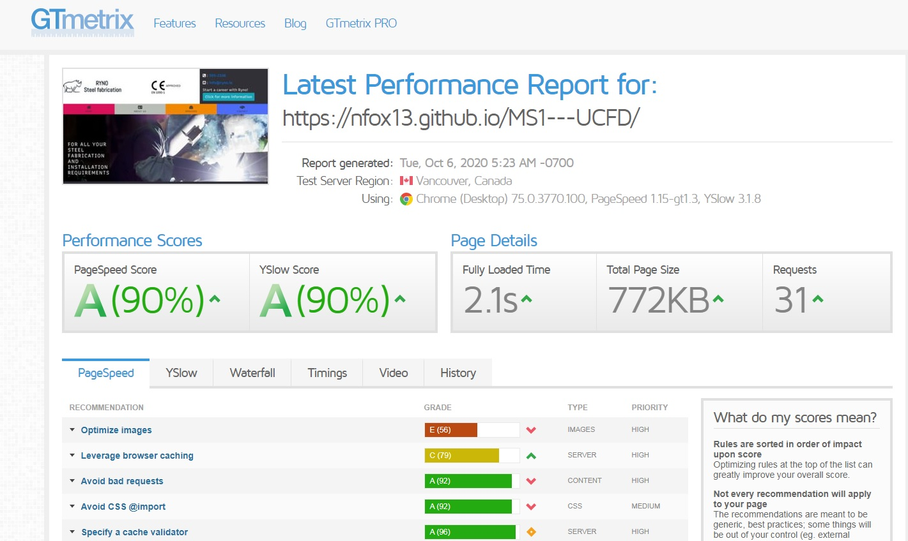

  

# Description

*This is a fictitious company*

> Ryno steel fabrication is a renowned company with a business ethic of customer satisfaction and reliability above all else.

> Ryno have been serving the Construction/Engineering sector for over 30 years and have grown to be one of the top steel fabrication companies in Europe.

# Deployment and Demo

Website has been deployed to [GitHub Pages](https://nfox13.github.io/MS1---UCFD/).

# Wireframe

The wireframe was designed using [Wireframe.cc]( https://wireframe.cc/) links to the original version can be found below:

- [Wireframe original idea](assets/images/wireframe.jpg)

# UX

I have opted for a simple design that I feel gets the information to the client effectively and directs them to the areas that they need to go.

- Home page: Contains all the company contact information along with a hero image, company location map, opening hours and a contact form.
- About us page: Contains an introduction to the company including year established etc. This also contains profiles of the Management team to let the client get familiar with the company.
- Services page: Contains information on the various services offered by the company with a button to link to the contact page.
- contact page: Contact page contains a contact form and also clickable phone number and email address.

In order to improve user experience and website loading speed, I have compressed the images using [tinypng.com](https://tinypng.com/) and the reduction in image size has been 68%.

# Visual Identity

- [Logo Pony](https://www.logopony.com/) for the logo design
- [Coolers](https://coolors.co/) for generating my colour scheme

# User Stories

Users:

- As a user, I'd like to get structural steel for a construction project
- As a user, I'd like to contact to enquire about Architectural metalwork for my house
- As a user, I'd like to know what services are offered and if the company offers what I require
- As a user, I'd like to know the opening hours and how I can contact the company
- As a user, I’d like to know if the company is hiring and how to contact the relevant person to confirm interest

Construction/Engineering Contractors:

- As a business owner, I'd like to see what services this company can offer as a sub-contractor
- As a business owner, I'd like to know if the company can offer site crews/labour
- As a business owner, I'd like to know who to contact and when I can contact them

# Testing

Website has been tested using [GTmetrix](https://gtmetrix.com/reports/nfox13.github.io/PoOnnUXq) see results below:

When I initially deployed the website, all my navbar links were returning a 404 message. I had used a relative path through the folders as opposed to services.html etc

Some of my images were not displaying when I used the img tag so I changed these to an anchor tag and they worked perfectly

To improve on the results I could work on the scaled images and also the browser caching

HTML and CSS has been tested using W3C validator and Jigsaw validator

# Technologies

- [Bootstrap](https://getbootstrap.com/)

# Media

I have used different resources for images, my logo, colour scheme etc.
All are listed below:

- [Font Awesome](https://fontawesome.com/) for the icons used on this site
- [Logo Pony](https://www.logopony.com/) for the logo design
- [Unsplash](https://unsplash.com/) for all the images
- [Am I Responsive](http://ami.responsivedesign.is/) for the responsive image in the UX section
- [Coolers]( https://coolors.co/) for generating my colour scheme
- [Raptor Engineering solutions]( https://www.raptorengineeringsolutions.com/) for the CE logo

# Thanks to
I would like to thank the following for their part in this project
- Font awesome
- Bootstrap
- Coolers
- Logo pony
- Unsplash
- Github
- Gitpod
- Code Institute tutorials
- Fellow students and leads on Slack
- Code Institute support
- My project Mentor Felipe Souza Alarcon
- W3 schools

All of the above had an input or gave inspiration to various elements of this project
